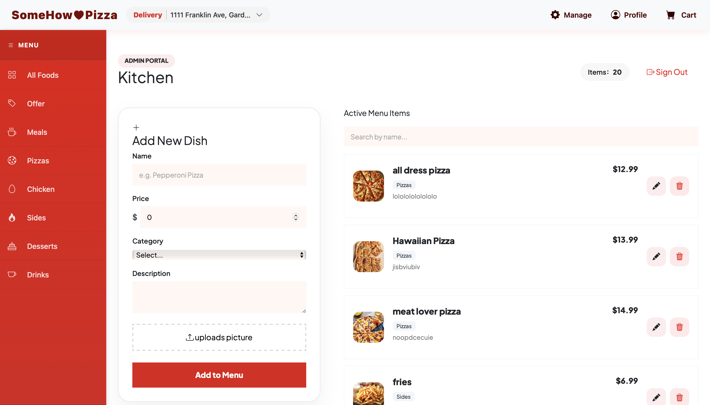

# Food Ordering App (Full Stack)
A full-stack food ordering system built with:
- Frontend: Angular 21 + Bootstrap 5
- Backend: Node.js + Express
- Database: MariaDB
- Cache: Redis
- Containerization: Docker

## Features 
- User authentication (JWT)
- Role-based access (Admin / User)
- Food CRUD (Create, Read, Update, Delete)
- Image upload (Multer + UUID)
- Shopping cart system
- Order management
- Real-time order notifications (Socket.io)
- Redis caching
- Scheduled cleanup (node-cron)
- Google Maps address integration
- Dockerized full-stack deployment
## Commands
npm install -g @angular/cli
ng version
ng new food-ordering-app

node -v
npm -v
npm init -y
npm install express mysql2 cors dotenv
npm install -D 
npm install mysql2
npm start / npm run dev

brew install mariadb
brew services start mariadb
brew services stop mariadb
mysql -u dbeaver -p -h 127.0.0.1 -P 3306
USE food_ordering;
SHOW TABLES;

npm install redis
npm install node-cron
brew install redis
brew services start redis

npm install @types/google.maps --save-dev
npm install @googlemaps/extended-component-library

softwareupdate --install-rosetta
npm install sequelize@latest
docker builder prune -f
docker-compose up -d
docker-compose ps
docker-compose logs -f backend
docker-compose down 
docker-compose up --build
